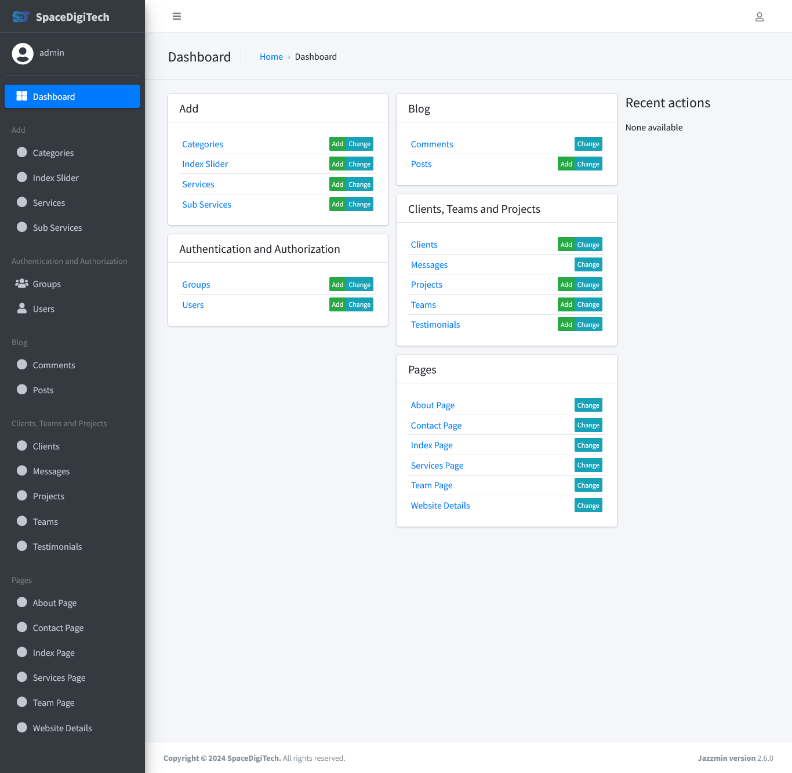

# Space DigiTech Company Website

A multipurpose company website made with Python Django.

| Previews                                                                                     |
| -------------------------------------------------------------------------------------------- |
| *Homepage*<br/>                        |
| *Admin panel*<br/> |

---

## Requirements

- Python 3.11 or higher

- PostgreSQL

- smtp4dev

- Git Bash (Optional)

---

## Installation

Open `cmd` or `bash` in the project directory.

**Install Python virtual environment**

```bash
pip install virtualenv
```

**Create a virtual environment**

```bash
virtualenv env_name
```

**Activate virtual environment**

On `Mac` and `Linux` (Also if you are using `bash` on `Windows`)

```bash
source env_name/bin/activate
```

On `Windows` (If you are using `cmd`)

```bash
.\env_name\Scripts\activate
```

**Install dependencies**

```bash
pip install -r requirements.txt
```

---

## Run Locally

At first create a new `PostgreSQL` database.

Configure database in `settings.py`

```python
DATABASES = {
    "default": {
        "ENGINE": "django.db.backends.postgresql",
        "NAME": "YOUR_DATABASE_NAME",
        "USER": "DATABASE_USER",
        "PASSWORD": "DATABASE_PASSWORD",
        "HOST": "localhost",
        "PORT": "5432",
    }
}
```

**Migrate database**

```bash
python manage.py makemigrations && python manage.py migrate
```

**Create an admin user**

```bash
python manage.py createsuperuser
```

**Run the `Django` server**

```bash
python manage.py runserver
```

You can access the website at http://127.0.0.1:8000/ and the admin panel at http://127.0.0.1:8000/admin

---

## License

[MIT](https://choosealicense.com/licenses/mit/)
